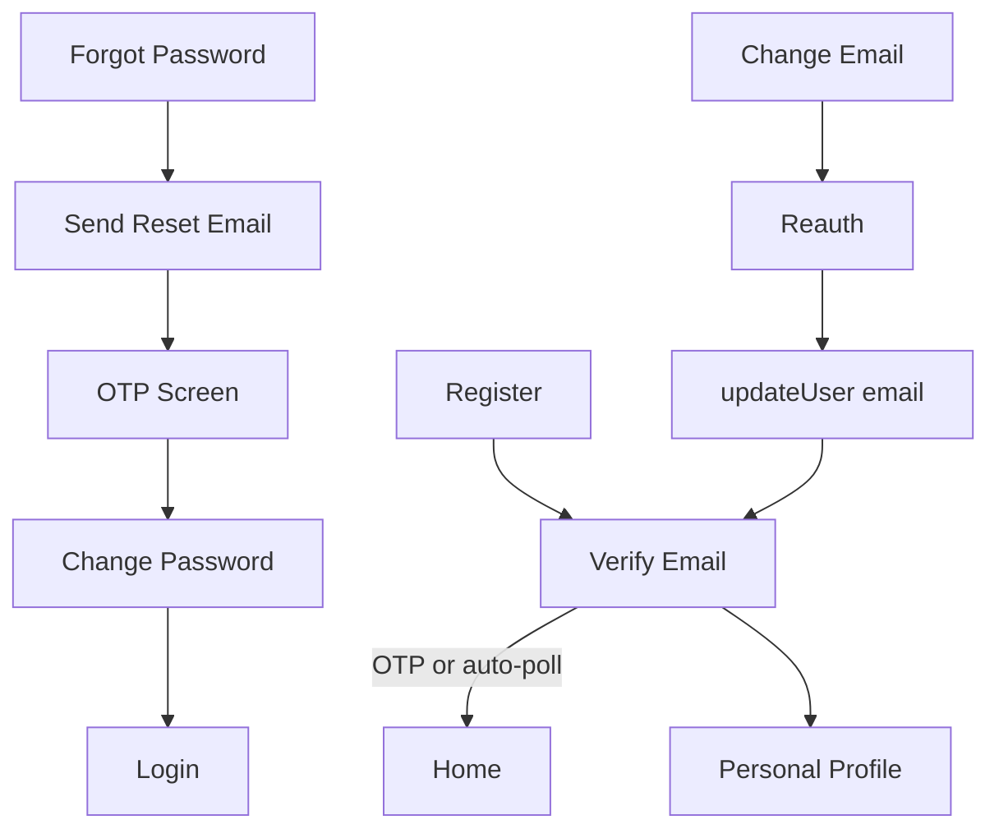

# Kasby User App — Authentication Implementation Report

**Date:** June 12, 2026  
**Scope:** Production-grade in-app Supabase Authentication (GetX architecture preserved)

---

## Executive Summary

The Kasby user app now provides a **seamless in-app authentication experience** across signup verification, password reset, email change, reauthentication, and session/profile refresh. Users stay inside the Flutter app for OTP entry, resend, and status polling wherever Supabase supports it. Phone-based flows continue using the existing FCM OTP + Edge Function pipeline.

---

## Modified Files

| File | Changes |
|------|---------|
| `lib/core/services/auth_security_service.dart` | OTP verify/resend, session refresh, reauth, email change, password update |
| `lib/features/auth/presentation/controllers/auth_controller.dart` | Verification gates, in-app reset navigation, OTP helpers |
| `lib/features/auth/presentation/views/verify_email_view.dart` | Premium verify screen: OTP input, countdown, auto-poll, auto-continue |
| `lib/features/auth/presentation/views/otp_view.dart` | Supabase native recovery/signup OTP, resend timer, localized UX |
| `lib/features/auth/presentation/views/forgot_password_view.dart` | Email reset → in-app OTP verification flow |
| `lib/features/profile/presentation/views/profile_update_view.dart` | Email change → Verify Email screen |
| `lib/features/profile/presentation/views/change_password_view.dart` | Reauth, recovery, session refresh, sign-out → login |
| `lib/features/profile/presentation/controllers/profile_update_controller.dart` | Reauth + Supabase email change + profile refresh |
| `lib/core/services/deep_link_service.dart` | Auth callback handling (fallback for email links) |
| `lib/core/localization/kasby_translations.dart` | EN/AR strings for verification & reset UX |
| `lib/features/splash/presentation/views/splash_view.dart` | Pending verification routing |
| `android/app/src/main/AndroidManifest.xml` | `io.supabase.kasby://login-callback` deep link |

---

## Authentication Flows Implemented

### 1. Email Verification (Confirm Sign Up)

```
Register → Verify Email Screen
  ├── Display email
  ├── Enter 6-digit Supabase OTP
  ├── Resend code (60s countdown)
  ├── Manual refresh status
  ├── Auto-poll every 8s
  └── Auto-continue → Home when verified
```

Access blocked until `emailConfirmedAt` is set (splash, auth listener, login gate).

### 2. Password Reset (Email — In-App)

```
Forgot Password → Send Reset Email
  → OTP Verification Screen (Supabase recovery OTP)
  → Verify Code
  → Change Password (recovery session)
  → Update Password + refresh
  → Sign out → Login
```

Phone reset unchanged: FCM OTP → custom secure reset → Change Password.

### 3. Change Email

```
Profile → Edit → Reauthenticate (password)
  → Enter new email → updateUser()
  → Verify Email screen (purpose: email_change)
  → OTP or auto-poll
  → Session + profile + GetX refresh → Personal Profile
```

### 4. Reauthentication

Required before:
- Change email (password step in `ProfileUpdateView`)
- Change password (current password in `ChangePasswordView`)
- Phone change (password step, existing flow)

Implemented via `AuthSecurityService.reauthenticateWithPassword()`.

### 5. Password Changed

- `updateUser(password)` + `hardRefreshSession()`
- Profile reload via `refreshUserProfileState()`
- Success snackbar; recovery path signs out and returns to login

### 6. Email Changed

- `OtpType.emailChange` verification or auto-poll
- `AuthChangeEvent.userUpdated` triggers profile refresh
- Email updates across profile/personal profile via `HomeController`

### 7. Phone Changed

- Existing OTP + `secure-profile-update` Edge Function
- Post-update: `refreshUserProfileState()` (session, profile, streams, wallet)

---

## UX Features (All Flows)

- Loading indicators on async actions
- 60-second resend countdown timers
- Resend + retry + manual refresh actions
- Localized error/success messages (EN/AR)
- `flutter_animate` transitions on auth screens
- Kasby design system (gold accent, cards, typography)
- Auto-navigation on verification success
- Silent background polling on Verify Email screen

---

## Security

- Passwords, tokens, OTP codes, and secrets are **never logged**
- Reauthentication required before sensitive profile operations
- Supabase `AuthException` responses validated and mapped to user-safe messages
- User enumeration mitigated on login/forgot-password errors
- Recovery session cleared via sign-out after password reset

---

## Debug Logging

Uses `SafeGetx.debugTrace` and `AuthController._log` for:
- Registration, email verification, password reset
- Change email, reauthentication
- Session refresh, profile refresh
- Auth state change events (`SupabaseService.registerAuthListener`)

---

## Verification Results

| Check | Result |
|-------|--------|
| `flutter analyze` (auth modules) | **Pass** — no issues |
| `flutter test` | **Pass** — 86/86 |
| Manual E2E on device | **Pending** — requires Supabase dashboard + physical device |

### Manual test checklist

1. Register → Verify Email → enter OTP → auto/home navigation
2. Resend code with countdown enforcement
3. Login with unconfirmed email → Verify Email screen
4. Forgot password (email) → OTP → new password → login
5. Change password in profile with reauth
6. Change email → Verify Email → profile email updates
7. Change phone → OTP → phone updates in UI
8. Invalid OTP → error message, no crash

---

## Supabase Dashboard Requirements

1. Add redirect URL: `io.supabase.kasby://login-callback`
2. Enable: Confirm sign up, Reset password, Change email, Reauthentication
3. Email templates must include **6-digit OTP token** (`{{ .Token }}`) for in-app code entry
4. Optional `.env`: `SUPABASE_AUTH_REDIRECT=io.supabase.kasby://login-callback`

---

## Remaining Recommendations

1. **iOS URL scheme** — Add `io.supabase.kasby` to `Info.plist` for deep-link fallback
2. **Email template audit** — Confirm signup/recovery templates send OTP codes (not link-only)
3. **Widget/integration tests** — Mock `GoTrueClient` for OTP and verification flows
4. **Delete account** — When implemented, reuse reauthentication gate
5. **Rate-limit UX** — Dedicated copy when Supabase returns rate-limit errors on resend

---

## Production Readiness Assessment

| Area | Status |
|------|--------|
| Code quality & tests | **Ready** |
| In-app UX completeness | **Ready** |
| Security practices | **Ready** |
| Supabase configuration | **Action required** (redirect URL + email templates) |
| iOS deep links | **Partial** |
| Manual QA | **Pending** |

**Overall:** Near production-ready. Ship after Supabase dashboard configuration and device QA.

---

## Flow Diagram



---

*Report generated for the complete Supabase Authentication integration.*
